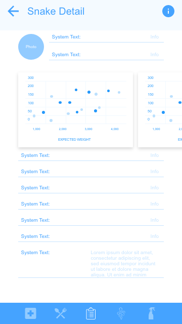

# The Snake App Android
## Description
TSA is an app that will help Snake's keepers to manage all of is snakes, this includes a close look on every snake (feed, med checks, cleans, sheds).
Breeding controls, as clutch controls.
Setting Lost and dead snakes.
This App also allows changing basic User info.

This is a Multi-platform app and will be connected with the iOS app.
## Wireframe - Low Fidellity
Wireframes are used to see UX, basically the way user will interact with the app by knowing where will the buttons, text's, etc. will be.

### Lobby - Snake Lists

### Lobby - Delete Snake 

### Snake Detail

